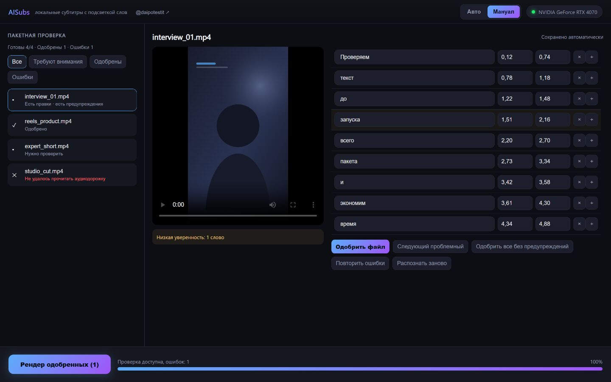

# AISubs — пакетные субтитры с контролем перед рендером

AISubs — настольное приложение для Windows, которое распознаёт речь в видео,
создаёт пословные тайминги и вшивает субтитры с подсветкой произносимого слова.
Можно прогнать весь пакет автоматически или проверить слова и тайминги перед
единым пакетным рендером.

Видео, звук, транскрипты и черновики обрабатываются локально. Аккаунт, API-ключ
и подписка не нужны. Интернет требуется для установки зависимостей и первой
загрузки модели распознавания.

[Страница проекта](https://jimmorisedu-boop.github.io/aisubs-local/) ·
[Проект и обновления: @daipotestit](https://t.me/daipotestit)



## Авто или Мануал

| | Авто | Мануал |
|---|---|---|
| Когда выбирать | Исходники чистые, нужен результат без остановок | Текст важен, ошибки лучше исправить до рендера |
| Пакет | Распознавание и рендер идут по очереди до конца | Сначала пакетная транскрибация, затем рендер одобренных файлов |
| Контроль текста | Без промежуточной проверки | Редактор слов, начала и конца каждого слова |
| Ошибки | Ошибка одного файла не скрывает состояние остальных | Фильтр ошибок, повтор неудачных файлов, повторное распознавание выбранного |
| Восстановление | Повторное распознавание берётся из кэша | Последний пакет, черновики и одобренные версии восстанавливаются после перезапуска |

Оба режима используют одну очередь, одинаковые настройки распознавания и один
редактор стиля. Авто остаётся режимом по умолчанию.

## Что умеет

- **Пакетная обработка.** Добавьте несколько роликов и следите за состоянием и
  прогрессом каждого файла.
- **Пословная подсветка.** Плашка под текущим словом, смена цвета текста
  (караоке) или обычные субтитры без выделения.
- **Whisper с пословными таймкодами.** Модели от `base` до `large-v3`,
  автоопределение языка, GPU с безопасным переходом на CPU.
- **Живой предпросмотр.** Кадр исходного видео показывает размер шрифта,
  переносы, положение и подсветку до запуска рендера.
- **Системные и комплектные шрифты.** Поиск и фильтр реальной поддержки
  кириллицы.
- **Пресеты.** Пять готовых стилей; пользовательские стили сохраняются в JSON.
- **Безопасные результаты.** Существующие файлы не перезаписываются: при
  совпадении имени создаётся вариант с числовым суффиксом.


## Требования

| | |
|---|---|
| ОС | Windows 10 или 11, 64 бита |
| Видеокарта | NVIDIA с CUDA желательна; без неё распознавание работает на CPU, но медленнее |
| Место на диске | Около 5 ГБ для окружения и крупной модели |
| Интернет | Для установки и разовой загрузки выбранной модели |

Python и ffmpeg отдельно устанавливать не нужно: `setup.bat` размещает
портативное окружение внутри папки проекта и не меняет системный Python.

## Установка

```bash
git clone https://github.com/jimmorisedu-boop/aisubs-local.git
cd aisubs-local
```

1. Запустите **`setup.bat`**.
2. Выберите модель распознавания или пропустите загрузку.
3. Запустите **`run.bat`**.

Установщик загружает портативный Python, ffmpeg, Python-зависимости и, если
найдена NVIDIA, библиотеки cuBLAS. Доступные при установке модели:

| Модель | Примерный объём | Назначение |
|---|---:|---|
| `large-v3` | ~3 ГБ | максимальное качество |
| `distil-large-v3` | ~1.5 ГБ | быстрее, близкое качество |
| `small` | ~500 МБ | быстрый рабочий вариант |

Если модель не выбрана, она загрузится при первой обработке. Уже скачанная
модель определяется автоматически. Прерванную установку можно продолжить
повторным запуском `setup.bat`.

Другую модель можно подготовить вручную:

```bash
python\python.exe download_model.py distil-large-v3
```

### CUDA и Visual C++

cuBLAS не входит в драйвер NVIDIA. `setup.bat` устанавливает совместимые
библиотеки отдельно, если обнаруживает NVIDIA. Если CUDA недоступна, режим
`Авто (GPU, иначе CPU)` переходит на процессор.

Для запуска также нужен Visual C++ Redistributable 2015–2022
(`MSVCP140.dll`). На большинстве систем он уже установлен. При ошибке об этой
библиотеке используйте
[официальный установщик Microsoft](https://aka.ms/vs/17/release/vc_redist.x64.exe).

## Авто: пакет без остановок

1. Оставьте выбранным режим **Авто**.
2. Перетащите видео в окно или откройте системный выбор файлов.
3. Выберите модель, язык и устройство.
4. Настройте стиль в живом предпросмотре.
5. Нажмите **«Создать субтитры (N)»**.

Файлы обрабатываются последовательно. У каждого элемента видны состояние и
прогресс; ошибка одного файла не останавливает всю очередь. Кнопка остановки
завершает текущий файл и отменяет оставшуюся часть пакета. Готовые ролики
остаются доступными в `output/`.

## Мануал: проверка перед рендером

1. Переключитесь в **Мануал**, добавьте пакет и нажмите
   **«Транскрибировать (N)»**.
2. Открывайте готовые транскрипты, пока остальные файлы продолжают
   распознаваться.
3. Исправляйте текст, начало и конец слова. Можно удалить, восстановить или
   вставить слово. Правки сохраняются автоматически после короткой паузы.
4. Проверьте предупреждения. Слова с низкой уверенностью подсвечиваются, но не
   блокируют одобрение сами по себе.
5. Нажмите **«Одобрить файл»** или **«Одобрить все без предупреждений»**.
6. Когда транскрибация завершена, нажмите
   **«Рендер одобренных (N)»**.

Перед одобрением AISubs проверяет структуру транскрипта и тайминги. Пустой
транскрипт, отрицательное время, конец раньше начала или пересечение соседних
слов нужно исправить.

### Ошибки, отмена и повтор

- **Частичный успех.** Ошибка чтения или распознавания одного файла не мешает
  получить и проверить остальные транскрипты.
- **Повторить ошибки.** Повторно запускает неудачные и отменённые элементы,
  не пересчитывая весь пакет.
- **Распознать заново.** Создаёт новую ревизию выбранного файла с текущими
  настройками модели, языка и устройства.
- **Сохранность одобренного.** Новая транскрибация не уничтожает предыдущую
  одобренную версию.
- **Отмена.** Текущий файл завершается, оставшиеся элементы получают состояние
  отмены и могут быть повторены.

### Восстановление после перезапуска

Manual-пакеты и ревизии хранятся в `cache/revisions/`. При следующем запуске
приложение восстанавливает последний пакет, выбранные состояния, черновики и
одобренные версии. Если приложение закрыли во время правки, уже сохранённые
операции остаются на диске.

## Кэш и безопасные имена результатов

Транскрипция кэшируется в `cache/`. Ключ учитывает исходный файл и его версию,
модель и язык, поэтому смена стиля не запускает распознавание заново, а смена
параметров распознавания не подхватывает неподходящий кэш.

Auto и Manual проверяют папку `output/` до рендера. Если `clip.mp4` уже
существует или два исходника дают одинаковое имя, приложение создаёт
`clip_2.mp4`, затем `clip_3.mp4` и так далее.

## Типографика и стиль

- Короткие предлоги и союзы переносятся вместе со следующим словом и не
  остаются отдельной репликой.
- Плашка выравнивается оптически, поэтому её высота не скачет на буквах с
  верхними и нижними выносными элементами.
- Длинное слово или крупный шрифт уменьшаются только настолько, чтобы текст не
  вышел за доступную ширину кадра.
- Размер, регистр, цвет, обводка, тень, подсветка, положение, ширина блока и
  число строк видны в предпросмотре.

## Пресеты

Пресет — обычный JSON в папке `presets/`. Его можно сохранить из интерфейса,
отредактировать вручную или передать коллеге.

```json
{
  "name": "VK Pill (blue)",
  "font": "fonts/Montserrat-var.ttf#ExtraBold",
  "font_size": 84,
  "text_case": "upper",
  "highlight_style": "box",
  "box_color": "#3FA9E8",
  "position": "bottom"
}
```

`highlight_style`: `box`, `color` или `none`. `text_case`: `upper`, `lower`
или `none`.

## Командная строка

Полный цикл через готовый пресет:

```bash
run.bat "видео.mp4" "результат.mp4" --preset presets\vk_blue_pill.json
```

Раздельное распознавание и оформление:

```bash
python\python.exe transcribe.py видео.mp4 -o слова.json --model large-v3 --language ru
python\python.exe renderer.py видео.mp4 слова.json результат.mp4 --preset presets\hormozi.json
```

## Устройство проекта

| Файл / папка | Назначение |
|---|---|
| `app.py` | pywebview API, очереди Auto/Manual и системные действия |
| `pipeline.py` | раздельные фазы распознавания и рендера с кэшем |
| `transcribe.py` | faster-whisper и пословные таймкоды |
| `renderer.py` | отрисовка субтитров и сборка видео |
| `gui/index.html` | разметка и стили настольного интерфейса |
| `gui/app.js` | Auto-очередь, предпросмотр, стиль, шрифты и пресеты |
| `gui/manual-review.js` | пользовательский сценарий Manual Mode |
| `gui/manual-state.js` | чистые функции прогресса, предупреждений и render gate |
| `lib/manual_jobs.py` | долговечное состояние пакета, повторы и пакетный рендер |
| `lib/transcript_revisions.py` | ревизии, операции редактирования и проверка таймингов |
| `lib/output_planner.py` | неперезаписывающиеся имена результатов |
| `fontlist.py` | поиск шрифтов и проверка кириллицы |
| `mediaserver.py` | локальная раздача видео, кадров и шрифтов интерфейсу |
| `presets/` | готовые JSON-стили |
| `fonts/` | комплектные шрифты |
| `docs/` | GitHub Pages и актуальные скриншоты Auto/Manual |

Папки `python/`, `ffmpeg/`, `models/`, `cache/` и `output/` создаются локально
и в репозиторий не входят.

## Лицензии

Код AISubs распространяется по MIT — см. [`LICENSE`](LICENSE).

Шрифты в `fonts/` распространяются по SIL Open Font License 1.1: Montserrat,
Oswald, Rubik, Fira Sans, PT Sans, Bebas Neue, Poppins, Anton, Archivo Black и
Bangers.

Распознавание построено на
[faster-whisper](https://github.com/SYSTRAN/faster-whisper) (MIT) и
[Whisper](https://github.com/openai/whisper) от OpenAI (MIT).

Страница проекта: [jimmorisedu-boop.github.io/aisubs-local](https://jimmorisedu-boop.github.io/aisubs-local/)

Проект и обновления: [@daipotestit](https://t.me/daipotestit)
