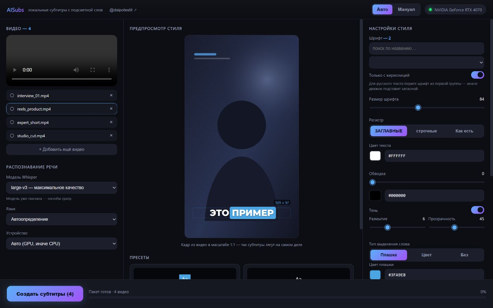

# AISubs — локальные субтитры с подсветкой произносимого слова

Настольное приложение для Windows: распознаёт речь в видео и вшивает субтитры,
подсвечивая слово, которое диктор произносит прямо сейчас — как в рекламных
роликах VK / TikTok / Reels.

**Всё работает офлайн.** Видео и звук никуда не отправляются: распознавание идёт
на вашей видеокарте, никаких ключей, аккаунтов и подписок не нужно.



---

## Что умеет

- **Пословная подсветка.** Три режима: цветная «плашка» под текущим словом,
  смена цвета текста (классическое караоке) или простые субтитры без подсветки.
- **Точное распознавание.** Whisper `large-v3` с пословными таймкодами, на GPU
  (CUDA) с автоматическим переходом на CPU, если видеокарта не подошла.
  100+ языков, автоопределение.
- **Пакетная обработка.** Перетащите хоть десяток роликов — обработаются
  очередью, с прогрессом по каждому.
- **Живой предпросмотр.** Кадр из вашего видео в масштабе 1:1: размер шрифта,
  отступы и перенос строк видны такими же, какими попадут в результат.
- **Любые шрифты.** Все установленные в Windows (включая поставленные «только
  для меня») плюс 14 хороших из комплекта. Есть поиск и фильтр «только с
  кириллицей» — он проверяет реальное наличие глифов, а не название шрифта.
- **Пресеты стиля.** Пять готовых, свои сохраняются и удаляются в один клик.
- **Типографика без ручной правки** — см. отдельный раздел ниже.

---

## Требования

| | |
|---|---|
| ОС | Windows 10 или 11 (64 бита) |
| Видеокарта | NVIDIA с CUDA — желательно. Без неё работает на процессоре, но заметно медленнее |
| Место на диске | ~5 ГБ: ~600 МБ окружение + ~3 ГБ модель `large-v3` |
| Интернет | только для установки и разовой загрузки модели |

Ставить Python или ffmpeg отдельно не нужно — установщик принесёт их в папку
проекта и нигде в системе ничего не пропишет.

---

## Установка

```bash
git clone https://github.com/jimmorisedu-boop/aisubs-local.git
```

Дальше в распакованной папке:

1. Запустите **`setup.bat`** — поставит всё необходимое.
2. Запустите **`run.bat`** — откроется окно приложения.

Что именно скачивает `setup.bat`:

| Что | Размер | Когда |
|---|---|---|
| Портативный Python и библиотеки | ~600 МБ | всегда |
| ffmpeg | входит в те же 600 МБ | всегда |
| Библиотеки CUDA (cuBLAS) | ~550 МБ | только если найдена видеокарта NVIDIA |
| Модель распознавания `large-v3` | ~3 ГБ | спросит — можно отказаться |

Если отказаться от модели, она скачается сама при первой обработке видео.
Скачать заранее или взять другой размер можно и вручную:

```bash
python\python.exe download_model.py distil-large-v3
```

Загрузка оборвалась — просто запустите `setup.bat` ещё раз: уже скачанное
повторно не качается, модель докачивается с места обрыва.

### Про CUDA

Библиотека cuBLAS **не входит в драйвер NVIDIA** и ставится отдельно — поэтому
`setup.bat` тянет её из pip, если видит видеокарту. Без неё распознавание
работает, но на процессоре и заметно медленнее. Если у вас уже установлен
CUDA Toolkit, всё заработает и без этой загрузки.

Ещё нужен **Visual C++ Redistributable 2015–2022** (`MSVCP140.dll`). На
большинстве систем он уже стоит; если приложение не запускается с ошибкой про
эту библиотеку — поставьте
[отсюда](https://aka.ms/vs/17/release/vc_redist.x64.exe).

---

## Как пользоваться

1. **Добавьте видео** — перетащите файлы в окно или нажмите на зону выбора
   (можно сразу несколько). Не-видео файлы отсеиваются сами.
2. **Слева** — модель, язык и устройство. По умолчанию `large-v3`,
   автоопределение языка и GPU с запасным вариантом на CPU.
3. **Справа** — стиль: шрифт, размер, регистр (ЗАГЛАВНЫЕ / строчные / как
   распознано), цвет, обводка, тень, вид подсветки, позиция, число строк,
   ширина блока. В центре сразу видно результат на кадре из вашего видео.
4. **«Создать субтитры»** — готовые файлы появятся в папке `output/`.

Распознавание кэшируется, поэтому перебирать стили быстро: повторный рендер
того же ролика занимает секунды, речь заново не распознаётся.

---

## Типографика

Мелочи, которые обычно правят вручную, здесь сделаны сами:

- **Предлоги и союзы не висят в конце строки.** «в», «и», «на», «что» и им
  подобные переносятся вместе со следующим словом. Если предлог не влезает
  никуда, движок чуть уменьшит шрифт этой реплики, но не покажет предлог
  отдельным кадром.
- **Плашка оптически выровнена.** Строится по заглавным буквам, а не по
  границам символов, поэтому слова с «хвостами» (Д, Ц, Щ, У) не съезжают
  относительно соседних, а высота плашки не скачет по ходу строки.
  Надстрочные знаки (краткая у Й) слегка выступают — как в ручной вёрстке.
- **Текст никогда не вылезает за кадр.** При крупном шрифте или длинном слове
  строка автоматически ужимается ровно настолько, чтобы уместиться.

---

## Командная строка

Интерфейс не обязателен — можно вызывать из скриптов:

```bash
run.bat "видео.mp4" "результат.mp4" --preset presets\vk_blue_pill.json
```

Или по шагам, если нужно разделить распознавание и рендер:

```bash
python\python.exe transcribe.py видео.mp4 -o слова.json --model large-v3 --language ru
```

```bash
python\python.exe renderer.py видео.mp4 слова.json результат.mp4 --preset presets\hormozi.json
```

---

## Устройство проекта

| Файл / папка | Назначение |
|---|---|
| `app.py` | Окно приложения и мост между интерфейсом и движком |
| `transcribe.py` | Распознавание речи, пословные таймкоды |
| `renderer.py` | Отрисовка субтитров, подсветка, типографика |
| `pipeline.py` | Связка «распознать → отрисовать» с кэшем |
| `fontlist.py` | Поиск шрифтов в системе, проверка кириллицы |
| `mediaserver.py` | Локальная отдача видео, кадров и шрифтов в интерфейс |
| `lib/` | Нарезка реплик и правила переносов |
| `gui/` | Интерфейс (HTML/CSS/JS) |
| `presets/` | Стили субтитров в JSON — можно править руками |
| `fonts/` | Шрифты из комплекта |

Папки `python/`, `ffmpeg/`, `models/`, `cache/`, `output/` создаются локально и
в репозиторий не входят.

---

## Пресеты

Обычный JSON — можно править в блокноте или сохранять из интерфейса:

```json
{
  "name": "VK Pill (blue)",
  "font": "fonts/Montserrat-var.ttf#ExtraBold",
  "font_size": 84,
  "text_case": "upper",
  "highlight_style": "box",
  "box_color": "#3FA9E8",
  "position": "bottom"
}
```

`highlight_style` — `box` (плашка), `color` (караоке) или `none`.
`text_case` — `upper`, `lower` или `none`.

---

## Лицензии

Код — MIT (см. `LICENSE`).

Шрифты в `fonts/` распространяются по SIL Open Font License 1.1:
Montserrat, Oswald, Rubik, Fira Sans, PT Sans, Bebas Neue, Poppins, Anton,
Archivo Black, Bangers.

Модели распознавания — [faster-whisper](https://github.com/SYSTRAN/faster-whisper)
(MIT) поверх [Whisper](https://github.com/openai/whisper) от OpenAI (MIT).
